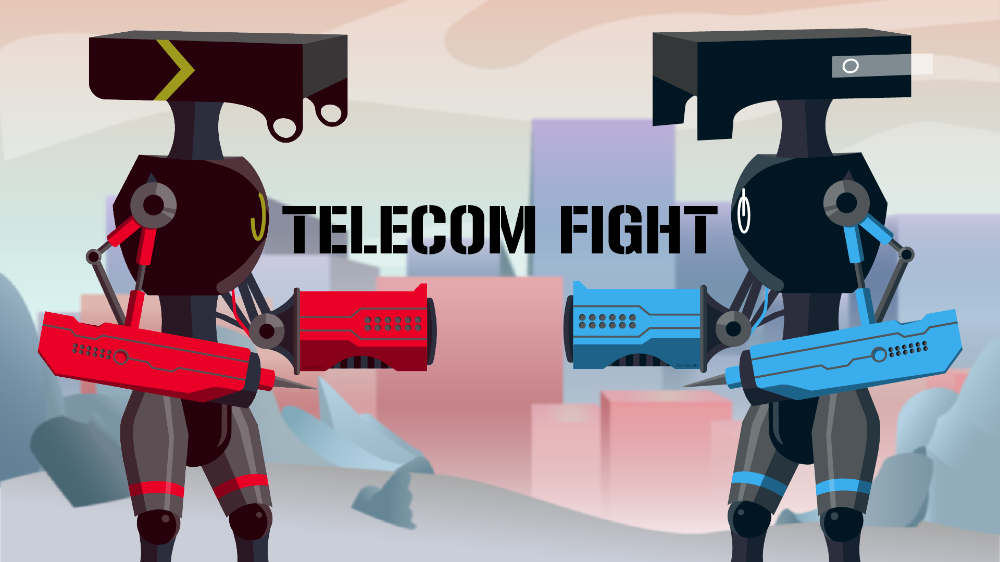

# Telecom Fight
[Telecom Fight](https://globalgamejam.org/2018/games/telecom-fight) is a game developed during the Global Game Jam 2018. Have fun!

# I want to play
- Download the archive [here](https://ggj.s3.amazonaws.com/games/2018/01/98989/exec/lhMWc/TelecomFightImage.zip) and unzip
- Launch the game, and select your character (space for keyboard and "A" for Xbox controllers)
- Use your mouse to click on "Press Start"
- Play :)

If you want to quit the game : ALT+F4 (sorry no menu buttons :p)

# Credits
- Benjamin Robert : Développeur
- Even Daniel : Graphiste
- Julian Didier : Développeur
- Kevin Keovilay : Développeur 
- Pierre DOUET : Graphiste
- Geoffroy Lambert : Sound Designer
